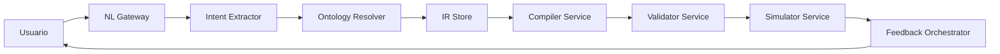

# Documentación Completa del Proyecto
# Plataforma de Automatización de Flujos de Trabajo con Motor de Reglas de Negocio

---

## 📋 Tabla de Contenidos

1. [Visión General del Proyecto](#visión-general-del-proyecto)
2. [Arquitectura Técnica](#arquitectura-técnica)
3. [Guías de Diseño UX](#guías-de-diseño-ux)
4. [Estrategias de Producto](#estrategias-de-producto)
5. [Desarrollo y Despliegue](#desarrollo-y-despliegue)
6. [Referencias y Recursos](#referencias-y-recursos)

---

## 🎯 Visión General del Proyecto

### Propósito

Esta plataforma permite a usuarios de negocio (no técnicos) diseñar, validar y ejecutar flujos de trabajo automatizados utilizando lenguaje natural y herramientas visuales, transformando automáticamente sus descripciones en un motor JSON declarativo ejecutable de nivel empresarial.

### Características Principales

- **Entrada en Lenguaje Natural**: Los usuarios describen flujos en texto simple
- **Motor de Reglas Reactivo**: Validación y ejecución de reglas en tiempo real
- **Constructor Visual**: Interfaz tipo IFTTT para reglas complejas
- **Validación en Tiempo Real**: Detección automática de conflictos y errores
- **Explicabilidad**: Sistema que explica por qué las reglas se activan o no
- **Integración con Sistemas Externos**: Conexión con CRM, ERP, email, etc.
- **Biblioteca de Plantillas**: Templates predefinidos para casos de uso comunes

### Tecnologías Utilizadas

- **Framework**: Angular 21+ con SSR (Server-Side Rendering)
- **UI**: Angular Material + Tailwind CSS
- **Animaciones**: Motion
- **IA**: Google Gemini API para procesamiento de lenguaje natural
- **Backend**: Express + Node.js
- **Despliegue**: Vercel (soporte completo para SSR)
- **Lenguajes**: TypeScript, HTML, CSS

---

## 🏗️ Arquitectura Técnica

### 1. Pipeline de Lenguaje Natural a Motor JSON

#### Fase A: Ingesta y Normalización

**1. Preprocesamiento Lingüístico**
- Detección automática de idioma
- Limpieza de ruido y expansión de abreviaturas del dominio
- Segmentación en oraciones y cláusulas para aislar:
  - Condiciones
  - Acciones
  - Excepciones

**2. Enriquecimiento de Contexto**
- Adjuntar metadatos relevantes:
  - Dominio de negocio
  - Catálogo de pasos permitidos
  - Conectores aprobados
  - Políticas de seguridad
- Resolver referencias de negocio conocidas (ej: "aprobación" = proceso humano con SLA)

#### Fase B: Comprensión Semántica Guiada

**3. Extracción Estructurada Asistida por LLM**
- Uso de prompts con esquema JSON estricto para extraer:
  - Actores
  - Entidades
  - Campos
  - Validaciones
  - Decisiones
  - Side-effects
- Salida con puntuaciones de confianza por elemento

**4. Grounding Contra Catálogo Interno**
- Mapeo de términos libres a tipos canónicos:
  - `FormStep`
  - `DecisionRule`
  - `HumanApprovalTask`
  - Otros tipos del motor
- Generación de múltiples hipótesis ranqueadas en caso de ambigüedad

#### Fase C: Construcción y Compilación

**5. Construcción de Intención Intermedia (IR)**
Producir un modelo neutral (no acoplado al runtime final) con semántica explícita.

**Estructura IR de Ejemplo:**
```json
{
  "intent_id": "uuid",
  "version": "1.0",
  "source": {
    "text": "Necesito un formulario de registro con validación de edad...",
    "language": "es",
    "spans": []
  },
  "entities": {
    "data_model": [
      {"name": "edad", "type": "integer", "required": true}
    ],
    "actors": ["solicitante", "aprobador"]
  },
  "flow": {
    "steps": [
      {"id": "s1", "kind": "form", "label": "Registro", "fields": ["edad"]},
      {"id": "s2", "kind": "decision", "label": "Validar edad"},
      {"id": "s3", "kind": "human_approval", "label": "Aprobación de menor"},
      {"id": "s4", "kind": "complete", "label": "Finalizar"}
    ],
    "edges": [
      {"from": "s1", "to": "s2"},
      {"from": "s2", "to": "s3", "when": "edad < 18"},
      {"from": "s2", "to": "s4", "when": "edad >= 18"},
      {"from": "s3", "to": "s4", "when": "approved == true"}
    ]
  },
  "constraints": [
    {"type": "validation", "expr": "edad >= 0 && edad <= 120"}
  ],
  "integrations": [],
  "ambiguities": [],
  "confidence": {
    "global": 0.92,
    "by_node": {"s3": 0.81}
  }
}
```

**6. Compilación IR → Motor JSON**
- Generar `Steps`, `Rules`, `Integrations` con trazabilidad por nodo
- Incluir metadatos: `source_span`, `rationale`

#### Fase D: Verificación y Feedback

**7. Validación Estática y Semántica**
Chequeos automáticos de:
- Esquema y tipos
- Rutas y estados terminales
- Ciclos infinitos
- Permisos y políticas

**8. Simulación de Escenarios**
- Ejecución en modo "dry-run"
- Casos sintéticos y de negocio
- Validación de resultados esperados

**9. Explicación al Usuario**
- Resumen "esto entendí"
- Preguntas de aclaración solo donde la confianza sea baja
- Visualización del flujo generado

### 2. Mapeo de Intención a Steps, Rules e Integraciones

#### Motor de Mapeo por Reglas Declarativas

Tabla de transformaciones versionadas:
- `IR.kind=form` → `Step(type="ui.form")`
- `IR.kind=decision` + `edges.when` → `Rule(type="expression")`
- `IR.kind=human_approval` → `Step(type="task.approval")`
- `IR.integration=email` → `Integration(type="smtp"|"api")`

**Ventajas:**
- Evita compilación solo por prompts
- Mejora reproducibilidad
- Facilita versionado

#### Estrategia de Rules

1. Convertir expresiones del IR a AST tipado
2. Validar tipos (edad entero, comparaciones válidas)
3. Emitir regla ejecutable del motor JSON

#### Estrategia de Integraciones

- Resolver integraciones por **catálogo corporativo**
- Nombre lógico → conector real
- No permitir endpoints arbitrarios desde NL
- Inyectar secretos desde vault por referencia (nunca texto plano)

### 3. Validación Automática Multinivel

#### Niveles de Validación

**1. Schema Validation**
- JSON cumple contrato
- Campos requeridos presentes
- Tipos correctos

**2. Type Validation**
- Campos, referencias y expresiones tipadas
- Compatibilidad de operadores

**3. Graph Validation**
- Sin nodos huérfanos
- Al menos un estado terminal
- No hay ciclos no controlados

**4. Policy Validation**
- Paso de aprobación requiere rol autorizado
- Integraciones solo desde allowlist
- Cumplimiento de políticas de seguridad

**5. Business Validation**
- No hay reglas contradictorias
- Priorización correcta de condiciones
- Cobertura completa de casos

### 4. Arquitectura de Componentes

#### Componentes Principales

- **NL Gateway**: Entrada, autenticación, rate limiting
- **Intent Extractor**: LLM + prompts estructurados
- **Ontology/Resolver Service**: Grounding con catálogo corporativo
- **IR Store**: Versiones, diffs, auditoría
- **Compiler Service**: IR → JSON engine
- **Validator Service**: Estático + semántico + políticas
- **Simulator Service**: Pruebas automáticas y análisis "what-if"
- **Feedback Orchestrator**: Preguntas de aclaración y refinamiento



---

## 🎨 Guías de Diseño UX

### 1. Estrategia de Niveles: Simple / Avanzado / Developer

#### Nivel 1: Simple (Orientado a Resultado)

**Para quién:** Usuarios de negocio, operaciones, analistas no técnicos

**Principios de UI:**
- Interfaz basada en objetivos y plantillas
- Máximo 5-7 decisiones por flujo
- Lenguaje no técnico
- Campos avanzados ocultos por defecto

**Promesa:** "Lo logras rápido, con mínimo riesgo"

#### Nivel 2: Avanzado (Orientado a Control)

**Para quién:** Power users, administradores funcionales

**Principios de UI:**
- Paneles de configuración intermedia habilitados
- Vistas comparativas (antes/después)
- Simulación de cambios
- Configuración por módulos con presets editables

**Promesa:** "Puedes ajustar comportamiento sin entrar a código"

#### Nivel 3: Developer (Orientado a Extensibilidad)

**Para quién:** Equipos técnicos, ingeniería, integradores

**Principios de UI:**
- Acceso a configuración completa
- APIs, hooks, scripts
- Versionado completo
- Observabilidad técnica (logs detallados, tracing, métricas)
- Entorno sandbox
- Control de despliegue

**Promesa:** "Control total con herramientas de ingeniería"

### 2. Asistente Paso a Paso (Workflow Wizard)

#### Secuencia de Preguntas (Lenguaje No Técnico)

**Paso 0: Contexto Rápido**
1. ¿Qué quieres lograr con este proceso?
2. ¿Dónde ocurre este proceso hoy?

**Paso 1: Disparador**
3. ¿Qué evento inicia este proceso?
4. ¿Con qué frecuencia ocurre?

**Paso 2: Actores y Responsables**
5. ¿Quién participa?
6. ¿Quién decide o aprueba?

**Paso 3: Pasos Principales**
7. ¿Cuáles son los 3-5 pasos clave?
8. ¿Qué información necesitas en cada paso?

**Paso 4: Reglas de Negocio**
9. ¿Cuándo se toma una ruta distinta?
10. ¿Qué debería pasar en cada caso?

**Paso 5: Integraciones**
11. ¿Con qué herramientas quieres conectar?
12. ¿Qué quieres hacer en cada herramienta?

**Paso 6: Resultado y Control**
13. ¿Cómo sabrás que el proceso fue exitoso?
14. ¿A quién hay que avisar al finalizar?

**Paso 7: Confirmación**
15. ¿Configuración recomendada o personalizada?

#### Preview Antes de Finalizar

**3 Capas de Visualización:**

1. **Resumen Ejecutivo (Texto Simple)**
   - Descripción en lenguaje natural del flujo completo

2. **Vista Visual del Flujo (Diagrama)**
   - Nodos + bifurcaciones con etiquetas legibles
   - Flujo de principio a fin

3. **Vista Técnica Opcional**
   - JSON generado (para usuarios avanzados)

**Controles Clave:**
- Editar rápido desde cada bloque
- Checklist de calidad
- Simulación con casos de prueba
- Botones: "Guardar borrador" / "Activar workflow"

### 3. Constructor Visual de Reglas (Rule Builder)

#### Estructura Visual (3 Paneles)

**Panel Izquierdo: Catálogo de Bloques**
- Datos/Variables disponibles
- Operadores legibles (es igual a, contiene, es mayor que, está entre)
- Acciones (mostrar, ocultar, validar, asignar, disparar alerta)
- Plantillas de reglas comunes
- Búsqueda semántica

**Panel Central: Canvas de Reglas**
- Tarjetas de regla con formato:
  - `SI` [condiciones]
  - `ENTONCES` [acciones]
  - `SI NO` (opcional)
- Soporte drag-and-drop
- Edición guiada en formularios

**Panel Derecho: Inspector Contextual**
- Metadatos de la regla
- Alcance (dónde aplica)
- Estado de calidad
- Traza de evaluación

#### Reglas Anidadas (Grupos Lógicos)

**Modelo Visual Recomendado:**
- Grupos con operador principal (`TODAS` = AND, `CUALQUIERA` = OR)
- Máximo 3 niveles de profundidad visible
- Colores semánticos por nivel
- Etiquetas persistentes del operador

**Ejemplo:**
```
SI TODAS
  ├─ País = MX
  ├─ CUALQUIERA
  │   ├─ Edad >= 18
  │   └─ TutorLegal = true
  └─ Canal != Partner
```

### 4. Sistema de Explicabilidad

#### Asistente "¿Por Qué?"

Capaz de responder:
- "¿Por qué este campo no aparece?"
- "¿Por qué esta regla no se activa?"
- "¿Qué está bloqueando este paso?"

#### Estructura de Explicación

**3 Capas de Respuesta:**

1. **Respuesta Corta** (1 frase)
   - "El campo X no aparece porque la condición Y no se cumple"

2. **Razones Detalladas** (2-4 puntos)
   - "Para mostrarse, X necesita A y B"
   - "Ahora mismo A sí se cumple, pero B no"
   - Valores reales observados

3. **Acciones Sugeridas**
   - "Verifica el valor de edad"
   - "Completa el paso 'Datos personales'"

#### Detección de Conflictos Lógicos

**Tipos de Conflicto:**
- Condiciones mutuamente excluyentes
- Reglas sombra (shadowing)
- Dependencias circulares
- Ramas muertas (inalcanzables)
- Inconsistencia temporal

### 5. Validación en Tiempo Real

#### Motor de Validación Incremental

**Pipeline de Validación:**

1. **Parse + Schema Validation** (rápido)
2. **Construcción de grafo** con índices
3. **Análisis estático incremental** (solo subgrafo impactado)
4. **Post-procesado de diagnósticos** con priorización

#### Detectores Clave

**A. Reglas Contradictorias**
- Detección de condiciones mutuamente excluyentes
- Normalización booleana (`A && !A`)
- Verificación de rangos disjuntos/solapados

**B. Loops Infinitos**
- Detección de ciclos en grafo dirigido (SCC)
- Validación de condiciones de salida
- Verificación de contadores/TTL

**C. Campos No Usados**
- Grafo de dependencia de datos
- Diferenciación "unused local" vs "unused global"

**D. Integraciones Mal Mapeadas**
- Validación contra contrato (OpenAPI/JSON Schema)
- Verificación de tipos y campos requeridos
- Validación de transformaciones

#### Niveles de Severidad

- **Error (bloqueante):**
  - Loop infinito probable
  - Requeridos de integración faltantes
  - Referencias rotas

- **Warning (no bloqueante):**
  - Campo nunca usado
  - Regla redundante
  - Mapeo riesgoso

#### UX de Errores

**Principios:**
- Progresivo, no punitivo
- Contextual (junto al elemento afectado)
- Accionable (con sugerencias de corrección)
- Agrupado (panel resumen)

**Interacciones:**
- Badge discreto: "3 errores · 5 warnings"
- Resaltado visual por nodo (rojo/ámbar)
- Panel "Problemas" con filtros
- Botón "Arreglar automáticamente" cuando aplique

### 6. Guía de UX Writing

#### Tabla de Equivalencias

| Término Técnico | Alternativa de Negocio | Cuándo Usarla |
|---|---|---|
| Workflow | Proceso / Flujo de trabajo | Recorrido completo de operación |
| Instance | Caso / Ejecución | Corrida específica de un proceso |
| Step | Etapa / Acción | Bloque dentro del proceso |
| Rule | Condición / Criterio | Lógica de decisión |
| AST | (no mostrar) | Solo documentación técnica interna |
| Integration | Conexión / Sistema conectado | Enlace con herramientas externas |

#### Principios para Nombrar Funciones

1. **Empezar por el objetivo de negocio**
   - ✅ "Aprobar solicitud"
   - ❌ "Evaluar regla de estado"

2. **Usar verbo + resultado esperado**
   - "Enviar factura"
   - "Asignar responsable"
   - "Validar datos del cliente"

3. **Hablar en el idioma del usuario final**
   - Si ventas dice "oportunidad", usar "oportunidad" (no "lead")

4. **Evitar ambigüedades**
   - Usar "Condición de aprobación" en vez de solo "Condición"

---

## 📊 Estrategias de Producto

### 1. Biblioteca de Templates

#### Categorías Estratégicas

**A. Captación y Conversión**
- Landing + formulario de lead
- Registro a demo
- Lead magnet (ebook/webinar)
- Encuesta de calificación

**B. Onboarding de Cliente**
- Bienvenida por email + checklist
- Activación por hitos
- Secuencia de primeros 7 días
- Recolección de datos iniciales

**C. Ventas y Seguimiento**
- Recordatorio de propuesta
- Seguimiento post demo
- Reactivación de oportunidades frías
- Pipeline con tareas automáticas

**D. Soporte y Éxito del Cliente**
- Recepción y triage de tickets
- Cierre de ticket + CSAT
- Escalamiento por SLA
- Base de ayuda automática

**E. Retención y Expansión**
- Campañas de reactivación
- Upsell/cross-sell por comportamiento
- Renewal reminder
- Programas de fidelización

**F. Operación Interna**
- Aprobaciones internas
- Solicitudes de vacaciones/IT
- Notificaciones entre equipos
- Flujos de handoff

#### Estructura de un Template

Cada template debe incluir:

1. **Nombre orientado a resultado**
2. **Problema que resuelve** (1 frase)
3. **Cuándo usarlo / cuándo no**
4. **Tiempo estimado de activación**
5. **Dificultad** (Básico/Intermedio/Avanzado)
6. **Requisitos previos**
7. **Blueprint visual del flujo**
8. **Variables editables predefinidas**
9. **Contenido sugerido por defecto**
10. **Reglas de seguridad**
11. **Resultado esperado + benchmark**
12. **Mini guía de optimización**

#### Sistema de Personalización Guiada

**Wizard de 4 Pasos:**

1. **Objetivo** - ¿Qué quieres lograr?
2. **Contexto** - Tipo de negocio, audiencia, volumen
3. **Personalización Mínima** - Campos esenciales
4. **Validación + Lanzamiento** - Checklist y simulación

### 2. Framework de Métricas de Telemetría

#### KPIs Principales

**A. Valor Entregado**
- **Activation Rate**: % que alcanza primer resultado de valor
- **Time to First Value (TTFV)**: Tiempo hasta primer hito
- **Feature Adoption by Segment**: % adopción por segmento

**B. Conversión y Crecimiento**
- **North Star Conversion**: % completan flujo core
- **Trial-to-Paid / Freemium-to-Paid**: Conversión por cohorte
- **Expansion Signals**: % incrementan uso de features premium

**C. Retención y Salud**
- **Week 1 / Week 4 Retention**: Retención temprana
- **Logo Churn Risk Index**: Índice de riesgo de abandono
- **Stickiness (DAU/WAU o WAU/MAU)**: Frecuencia de uso

**D. Eficiencia Operativa**
- **Successful Journey Rate**: % journeys completados sin fricción
- **Error Impacted Revenue Sessions**: Sesiones afectadas por errores
- **SLA de Experiencia**: % sesiones dentro de umbrales

#### Funnel Visual: Dual Funnel

**Funnel A: Adquisición → Valor**
1. Cuentas creadas
2. Onboarding iniciado
3. Onboarding completado
4. Primer valor alcanzado
5. Uso recurrente en 7 días

**Funnel B: Valor → Monetización**
1. Usuarios activos con valor
2. Uso de feature monetizable
3. Intento de compra/upgrade
4. Pago exitoso
5. Renovación/expansión

#### Detección Automática de Fricción

**Señales de Fricción:**
- Reintentos repetidos
- Tiempo excesivo vs benchmark
- Backtracking entre pasos
- Caída abrupta en conversión
- Error técnico + abandono inmediato

**Friction Score por Etapa (0-100):**
- 35% caída de conversión
- 25% incremento de tiempo p90
- 20% tasa de errores con impacto
- 20% señales de frustración

---

## 🚀 Desarrollo y Despliegue

### Estructura del Proyecto

```
broxel/
├── src/
│   ├── app/
│   │   ├── builder/          # Constructor visual de workflows
│   │   ├── wizard/           # Asistente paso a paso
│   │   ├── renderer/         # Renderizador de flujos
│   │   ├── dashboard/        # Panel principal
│   │   ├── models/           # Modelos de datos
│   │   └── plugins/          # Plugins extensibles
│   ├── core/
│   │   ├── auth/             # Autenticación y permisos
│   │   ├── explainability/   # Sistema de explicabilidad
│   │   ├── integrations/     # Motor de integraciones
│   │   ├── orchestrator/     # Orquestador de workflows
│   │   ├── plugins/          # Sistema de plugins
│   │   ├── rule-engine/      # Motor de reglas
│   │   ├── security/         # Seguridad
│   │   └── telemetry/        # Telemetría
│   └── styles.css
├── docs/                     # Documentación técnica
├── public/                   # Assets estáticos
├── api/
│   └── render.ts            # Función serverless para SSR
├── package.json
├── angular.json
├── tsconfig.json
└── vercel.json              # Configuración de Vercel
```

### Comandos de Desarrollo

#### Instalación de Dependencias

```bash
npm install
```

#### Desarrollo Local

```bash
# Servidor de desarrollo
npm run dev

# Puerto por defecto: 3000
# La aplicación estará disponible en http://localhost:3000
```

#### Construcción para Producción

```bash
# Build optimizado
npm run build

# Alias específico para Vercel
npm run vercel-build
```

#### Pruebas

```bash
# Ejecutar tests
npm test

# Linting
npm run lint
```

#### Servidor SSR Local

```bash
# Servir la aplicación SSR compilada
npm run serve:ssr:app
```

### Variables de Entorno

Crear archivo `.env.local` basado en `.env.example`:

```bash
# Requerido para funcionalidad de IA
GEMINI_API_KEY=tu_api_key_aqui
```

### Despliegue en Vercel

#### Método 1: Dashboard de Vercel (Recomendado)

1. **Preparar el código**
   ```bash
   git init
   git add .
   git commit -m "Preparar para despliegue"
   git remote add origin <tu-repositorio-url>
   git push -u origin main
   ```

2. **Importar en Vercel**
   - Ir a [Vercel Dashboard](https://vercel.com/dashboard)
   - Clic en "Add New Project"
   - Importar repositorio Git
   - Vercel detectará automáticamente Angular

3. **Configurar Variables de Entorno**
   - En configuración del proyecto
   - Agregar `GEMINI_API_KEY`
   - Aplicar a Production, Preview, Development

4. **Desplegar**
   - Clic en "Deploy"
   - Vercel construirá y desplegará automáticamente

#### Método 2: Vercel CLI

```bash
# Instalar Vercel CLI
npm install -g vercel

# Login
vercel login

# Despliegue de vista previa
vercel

# Despliegue a producción
vercel --prod
```

#### Configuración de Vercel

El archivo `vercel.json` está preconfigurado:

```json
{
  "version": 2,
  "builds": [
    {
      "src": "package.json",
      "use": "@vercel/static-build",
      "config": {
        "distDir": "dist/app/browser"
      }
    }
  ],
  "routes": [
    {
      "src": "/api/render",
      "dest": "/api/render.ts"
    },
    {
      "handle": "filesystem"
    },
    {
      "src": "/(.*)",
      "dest": "/api/render"
    }
  ]
}
```

### Arquitectura de Despliegue

- **Frontend**: Servido como sitio estático optimizado
- **SSR**: Función serverless en `/api/render.ts`
- **Rutas**: Configuradas para Angular routing
- **Build**: Optimizado para producción

### Testing del Build Local

```bash
# Construir la aplicación
npm run build

# Servir SSR localmente
npm run serve:ssr:app

# Visitar http://localhost:4000
```

---

## 📚 Referencias y Recursos

### Documentación Técnica Adicional

Para información más detallada sobre aspectos específicos, consultar:

- **Arquitectura de Pipeline NL**: [`NL_PIPELINE_ARCHITECTURE.md`](NL_PIPELINE_ARCHITECTURE.md)
- **Estrategia UX Simplificada**: [`UX_SIMPLIFICADA_ESTRATEGIA.md`](UX_SIMPLIFICADA_ESTRATEGIA.md)
- **Guía de Despliegue en Vercel**: [`VERCEL_DEPLOYMENT.md`](VERCEL_DEPLOYMENT.md)
- **Estrategia de Telemetría**: [`PRODUCT_STRATEGY_TELEMETRIA.md`](../PRODUCT_STRATEGY_TELEMETRIA.md)
- **Diseño de Biblioteca de Templates**: [`TEMPLATE_LIBRARY_DESIGN.md`](../TEMPLATE_LIBRARY_DESIGN.md)

### Documentación de Diseño UX

- **Asistente de Explicabilidad**: [`docs/asistente-explicabilidad-reactiva.md`](docs/asistente-explicabilidad-reactiva.md)
- **Validación en Tiempo Real**: [`docs/real-time-flow-validation-design.md`](docs/real-time-flow-validation-design.md)
- **Constructor de Reglas**: [`docs/rule-builder-ux-concept.md`](docs/rule-builder-ux-concept.md)
- **Wizard de Workflows**: [`docs/ux-step-by-step-workflow-wizard.md`](docs/ux-step-by-step-workflow-wizard.md)
- **Lenguaje de Negocio**: [`docs/ux-writing-lenguaje-negocio.md`](docs/ux-writing-lenguaje-negocio.md)

### Enlaces Útiles

- **AI Studio**: [https://ai.studio/apps/c94396c4-dfbb-431a-b4fe-a83f2df7c0b7](https://ai.studio/apps/c94396c4-dfbb-431a-b4fe-a83f2df7c0b7)
- **Vercel Dashboard**: [https://vercel.com/dashboard](https://vercel.com/dashboard)
- **Angular Documentation**: [https://angular.dev](https://angular.dev)
- **Angular SSR**: [https://angular.dev/guide/ssr](https://angular.dev/guide/ssr)
- **Vercel Documentation**: [https://vercel.com/docs](https://vercel.com/docs)
- **Vercel CLI**: [https://vercel.com/docs/cli](https://vercel.com/docs/cli)

### Soporte y Comunidad

- **Vercel Community**: [https://github.com/vercel/vercel/discussions](https://github.com/vercel/vercel/discussions)
- **Vercel Status**: [https://www.vercel-status.com/](https://www.vercel-status.com/)
- **Angular Community**: [https://angular.dev/community](https://angular.dev/community)

---

## 🔒 Consideraciones de Seguridad

### Seguridad del Pipeline de Lenguaje Natural

1. **Exposición de Datos Sensibles**
   - Redacción automática (masking) de PII
   - Políticas por rol
   - Campos prohibidos en explicaciones

2. **Filtrado de Lógica Interna Crítica**
   - Niveles de detalle por permiso
   - Modo "negocio" sin expresiones internas sensibles
   - Protección de reglas antifraude

3. **Prompt/Query Injection**
   - Lista blanca de intents
   - Validación de targetId
   - Autorización previa a explicar

4. **Telemetría Manipulada**
   - Firmas de integridad
   - Timestamps confiables
   - Etiquetado de "baja confianza"

### Seguridad de Integrations

- No permitir endpoints arbitrarios desde NL
- Catálogo corporativo de integraciones aprobadas
- Secretos desde vault por referencia
- Nunca texto plano para credenciales

### Autenticación y Permisos

- Sistema de roles (Simple/Avanzado/Developer)
- Permisos granulares por capacidad
- Auditoría de cambios críticos
- Entornos separados (Sandbox/Staging/Producción)

---

## 🎯 Mejores Prácticas

### Diseño de Workflows

1. **Empezar Simple**
   - Usar templates predefinidos cuando sea posible
   - Mantener flujos con 3-7 pasos máximo inicialmente
   - Iterar y mejorar progresivamente

2. **Validar Constantemente**
   - Probar con datos reales en sandbox
   - Usar el simulador antes de publicar
   - Revisar métricas de fricción

3. **Documentar Decisiones**
   - Agregar descripciones a reglas complejas
   - Mantener historial de versiones
   - Explicar el "por qué" de las reglas

### Desarrollo de Features

1. **Extensibilidad mediante Plugins**
   - Usar el sistema de plugins para personalización
   - Mantener plugins desacoplados
   - Documentar interfaces de plugin

2. **Testing de Reglas**
   - Golden tests para frases de referencia
   - Property-based tests para reglas críticas
   - Mutation tests para validaciones
   - Replay tests con incidentes históricos

3. **Observabilidad**
   - Instrumentar métricas clave
   - Logging estructurado
   - Trazabilidad de decisiones

---

## 📈 Roadmap y Evolución

### Fase 1: Fundamentos (Actual)
- ✅ Pipeline NL → JSON
- ✅ Constructor visual de reglas
- ✅ Sistema de validación
- ✅ Biblioteca de templates
- ✅ Despliegue en Vercel

### Fase 2: Refinamiento (2-4 semanas)
- ⏳ Sistema de explicabilidad completo
- ⏳ Métricas de telemetría
- ⏳ Detección avanzada de conflictos
- ⏳ A/B testing de flujos

### Fase 3: Escala (4-8 semanas)
- 🔜 Integraciones con sistemas enterprise
- 🔜 Modo colaborativo multi-usuario
- 🔜 Versionado avanzado de workflows
- 🔜 Marketplace de templates

### Fase 4: Inteligencia (8-12 semanas)
- 🔮 Optimización automática de reglas
- 🔮 Predicción de resultados
- 🔮 Recomendaciones contextuales
- 🔮 Aprendizaje continuo del sistema

---

## 🤝 Contribución

### Cómo Contribuir

1. **Reportar Issues**
   - Usar el sistema de issues del repositorio
   - Incluir pasos para reproducir
   - Adjuntar logs relevantes

2. **Proponer Mejoras**
   - Documentar el caso de uso
   - Explicar el valor de negocio
   - Sugerir implementación técnica

3. **Desarrollo**
   - Fork el repositorio
   - Crear branch para feature/fix
   - Seguir convenciones de código
   - Incluir tests
   - Actualizar documentación
   - Enviar Pull Request

### Convenciones

- **Commits**: Usar conventional commits (feat:, fix:, docs:, etc.)
- **Branches**: feature/nombre, fix/nombre, docs/nombre
- **Code Style**: Seguir Angular style guide
- **Testing**: Mantener cobertura > 80%

---

## 📝 Licencia y Contacto

### Licencia
[Especificar licencia del proyecto]

### Contacto
[Información de contacto del equipo]

### Créditos
Desarrollado con Angular, Gemini AI, y Vercel.

---

**Última actualización:** Marzo 2026
**Versión de la documentación:** 1.0.0
