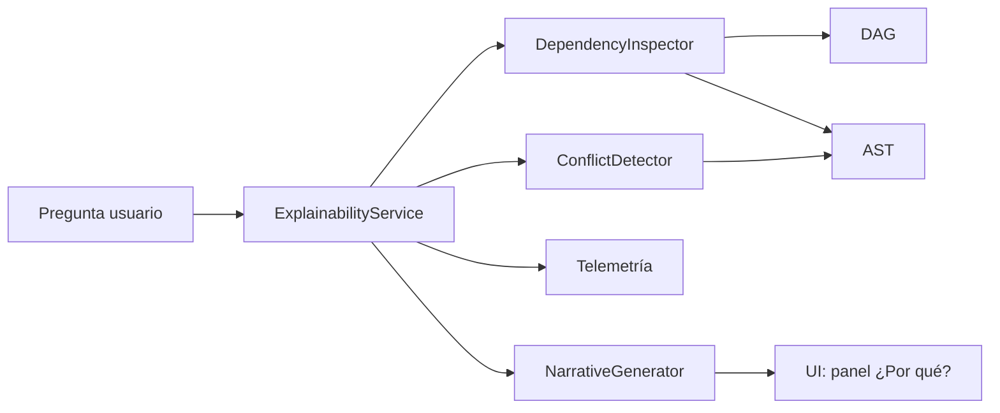

# Diseño: asistente de explicabilidad para motor reactivo

## Objetivo (en lenguaje simple)
Construir un asistente que pueda contestar preguntas como:
- **“¿Por qué este campo no aparece?”**
- **“¿Por qué esta regla no se activa?”**

sin obligar al usuario a leer código ni entender nodos internos.

---

## 1) Inspección automática de dependencias

### Qué tiene hoy el sistema
- **AST**: describe la lógica de reglas (qué condición se evalúa y qué acción se dispara).
- **DAG de dependencias**: muestra qué dato depende de cuál.
- **Telemetría**: registra qué se evaluó, en qué orden y con qué resultado.

### Propuesta de inspección (pipeline)
1. **Tomar la pregunta del usuario**
   - Detectar entidad principal: campo, regla, sección de formulario, visibilidad, validación.
2. **Resolver el “target”**
   - Buscar en el DAG el nodo exacto (`field:email`, `rule:show_discount`).
3. **Hacer traza hacia atrás (backward trace)**
   - Recorrer ancestros en el DAG para encontrar todas las condiciones y datos que impactan al target.
4. **Hacer traza hacia adelante (forward trace)**
   - Ver qué más se afecta por ese mismo nodo (útil para explicar efectos colaterales).
5. **Cruzar con AST compilado**
   - Mapear cada arista del DAG a su fragmento de regla en AST para mostrar “de dónde sale”.
6. **Cruzar con telemetría reciente**
   - Confirmar si esa ruta realmente se ejecutó y con qué valores reales.
7. **Generar “causas candidatas” priorizadas**
   - Prioridad alta: condiciones falsas en nodos críticos.
   - Prioridad media: datos no disponibles o desactualizados.
   - Prioridad baja: reglas que ni siquiera entraron al ciclo de evaluación.

### Estructura de salida interna recomendada
```ts
type WhyAnalysis = {
  questionType: 'missing_field' | 'rule_not_firing' | 'other';
  targetNodeId: string;
  dependencyChain: Array<{
    nodeId: string;
    nodeType: 'field' | 'rule' | 'input' | 'derived';
    lastValue: unknown;
    lastEvaluation: 'true' | 'false' | 'not_executed';
    evidence: 'telemetry' | 'ast' | 'dag';
  }>;
  likelyRootCauses: Array<{
    code: string;
    confidence: number; // 0-1
    plainText: string;
    technicalDetail: string;
  }>;
};
```

---

## 2) Generación de explicación humanizada

### Principio
La explicación debe responder en 3 capas:
1. **Respuesta corta** (1 frase)
2. **Porque** (2-4 razones ordenadas)
3. **Cómo solucionarlo** (acciones concretas)

### Plantilla sugerida (no técnica)
- **Resumen:** “El campo `X` no aparece porque la condición `Y` no se cumple.”
- **Detalle simple:** “Para mostrarse, `X` necesita A y B. Ahora mismo A sí se cumple, pero B no.”
- **Qué revisar:** “Verifica el valor de `edad` y que el paso ‘Datos personales’ esté completado.”

### Buenas prácticas UX de lenguaje
- Evitar términos como “topological ordering”, “short-circuit”, “AST node type”.
- Preferir: “orden de evaluación”, “la regla se detuvo aquí”, “esta condición depende de…”.
- Mostrar valores reales observados por telemetría:
  - “Se recibió `edad = 16`, y la regla pide `edad >= 18`.”

### Formato final recomendado
- **Qué pasó**
- **Por qué pasó**
- **Qué puedes hacer ahora**
- **Nivel de confianza** (Alta/Media/Baja)

---

## 3) Detección de conflictos lógicos

### Tipos de conflicto a detectar
1. **Condiciones mutuamente excluyentes**
   - Ej: una regla exige `pais = MX` y otra exige `pais = US` para el mismo resultado.
2. **Reglas sombra (shadowing)**
   - Una regla general se evalúa antes y bloquea una más específica.
3. **Dependencias circulares encubiertas**
   - Aunque el DAG global sea acíclico, puede haber ciclos semánticos por datos derivados externos.
4. **Ramas muertas**
   - Condiciones que nunca pueden ser verdaderas por contradicción interna.
5. **Inconsistencia temporal**
   - Telemetría indica que la fuente A cambia después de que B ya fue evaluada.

### Estrategia técnica de detección
- **Análisis estático (AST + DAG)**
  - Simplificación booleana para encontrar contradicciones.
  - Detección de reglas inalcanzables.
- **Análisis dinámico (telemetría)**
  - Señalar reglas con tasa de activación 0% en ventanas relevantes.
  - Detectar oscilaciones (true/false repetido) que indiquen inestabilidad.

### Salida para usuario no técnico
- “Encontramos dos reglas que se contradicen para el mismo campo.”
- “Una regla nunca se activa en los últimos 7 días; puede estar obsoleta.”
- “Hay una dependencia que llega tarde, por eso ves resultados inconsistentes.”

---

## 4) Integración en UI

### Dónde mostrarlo
1. **Panel lateral “¿Por qué?”** en el renderizador del flujo.
2. **Botón contextual** junto a cada campo/regla: “Explicar”.
3. **Modo diagnóstico** en builder con resaltado del camino causal en DAG.

### Flujo de interacción ideal
1. Usuario hace clic en “¿Por qué no aparece?” sobre un campo.
2. UI envía `targetId + snapshot de estado` al servicio de explicabilidad.
3. Servicio devuelve:
   - resumen humano,
   - evidencias,
   - pasos sugeridos.
4. UI presenta:
   - tarjeta simple para negocio,
   - acordeón técnico opcional para perfiles avanzados.

### Componentes UI sugeridos
- `ExplanationChip` (estado: Resuelto / Bloqueado / Incierto)
- `CausalPathViewer` (camino de dependencias resaltado)
- `FixSuggestionsList` (acciones accionables)
- `EvidenceTimeline` (últimos eventos de telemetría)

### Reglas de diseño para claridad
- Máximo 5 causas por respuesta.
- Ordenar por impacto y probabilidad.
- Evitar paredes de texto; usar bullets y etiquetas visuales.

---

## 5) Riesgos de seguridad

1. **Exposición de datos sensibles**
   - Riesgo: la explicación puede incluir PII desde telemetría.
   - Mitigación: redacción automática (masking), políticas por rol, campos prohibidos.

2. **Filtrado de lógica interna crítica**
   - Riesgo: revelar reglas antifraude o scoring sensible.
   - Mitigación: niveles de detalle por permiso; modo “negocio” sin expresiones internas.

3. **Prompt/Query injection en preguntas libres**
   - Riesgo: usuario intenta forzar al asistente a mostrar información no autorizada.
   - Mitigación: lista blanca de intents, validación de targetId, autorización previa a explicar.

4. **Telemetría manipulada o incompleta**
   - Riesgo: explicación incorrecta por evidencia alterada.
   - Mitigación: firmas de integridad, timestamps confiables, etiquetar “baja confianza”.

5. **Sobrecarga operativa**
   - Riesgo: análisis profundo en tiempo real degrada UX.
   - Mitigación: caché de trazas, límites de profundidad, modo rápido vs modo completo.

---

## Arquitectura mínima recomendada

- **ExplainabilityService**
  - Orquesta AST + DAG + Telemetría.
- **DependencyInspector**
  - Construye cadena causal y calcula impacto.
- **ConflictDetector**
  - Ejecuta validaciones lógicas estáticas y dinámicas.
- **NarrativeGenerator**
  - Traduce hallazgos técnicos a lenguaje no técnico.
- **UI Adapter**
  - Entrega payload listo para componentes visuales.



## Métricas de éxito
- % de respuestas entendidas en primer intento (encuesta in-product).
- Reducción de tickets “no entiendo por qué no funciona”.
- Tiempo medio para encontrar causa raíz.
- Precisión percibida de explicaciones (feedback 👍/👎).

## Resultado esperado para usuarios no técnicos
“Cuando algo no aparezca o no se active, el sistema explicará **qué bloquea**, **dónde está el bloqueo** y **qué hacer para solucionarlo**, en lenguaje claro y con evidencia.”
